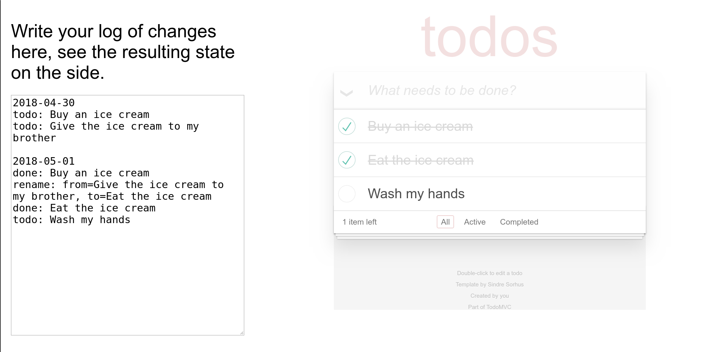

Write the facts on a plaintext format, they are parsed by custom rules (defined in [js/app.js](js/app.js#L59-L119)) and a state is generated. We use that final state to render the todomvc UI on the right.

Try it on https://journalstate-todomvc.alhur.es/
